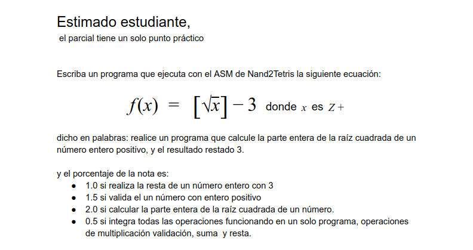
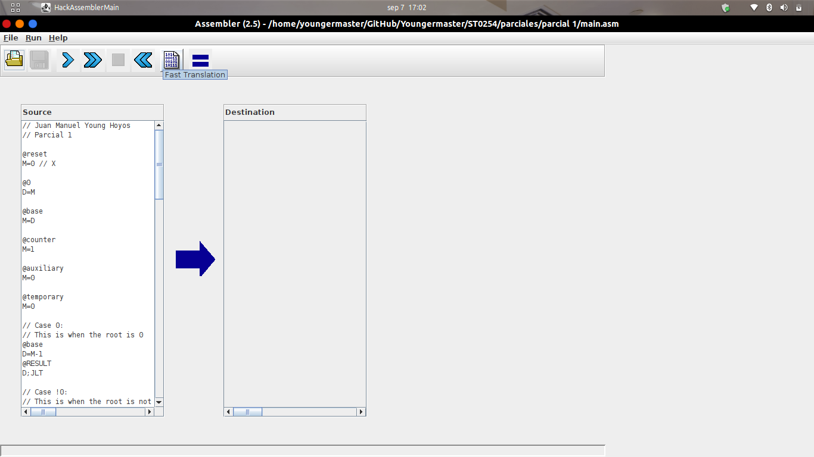
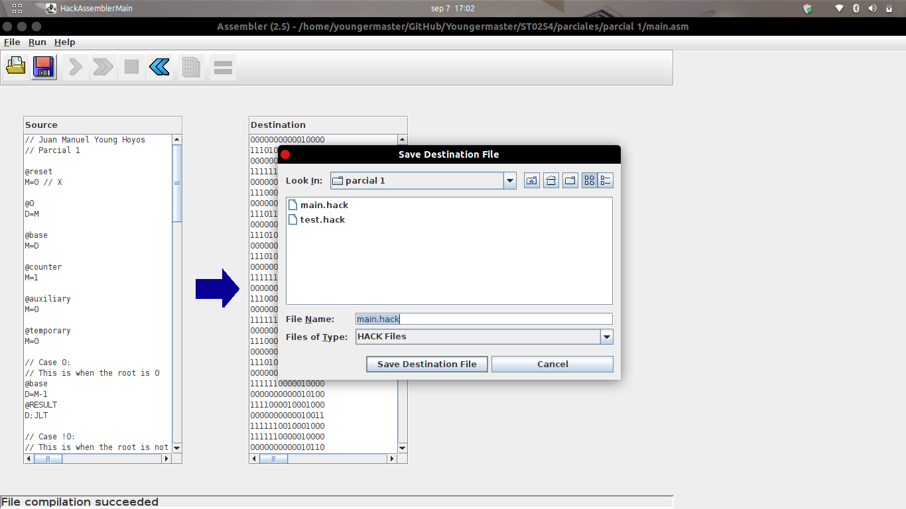
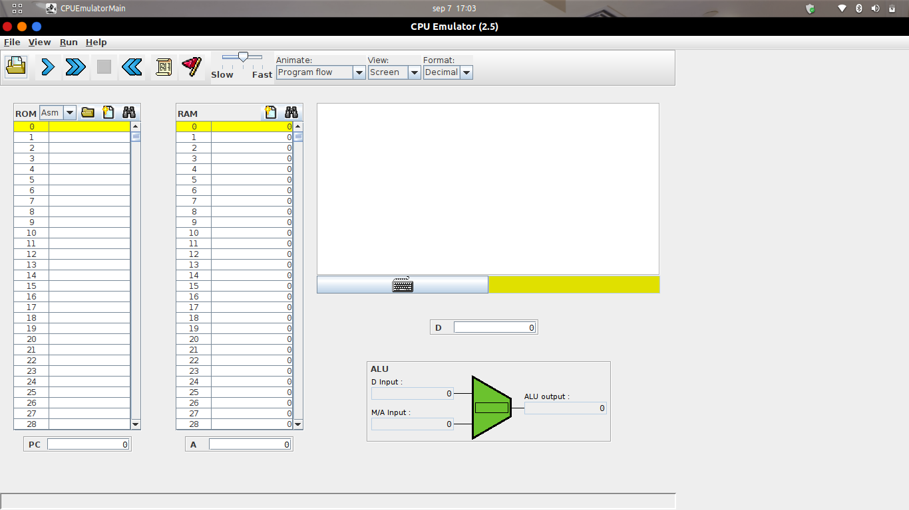
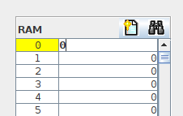
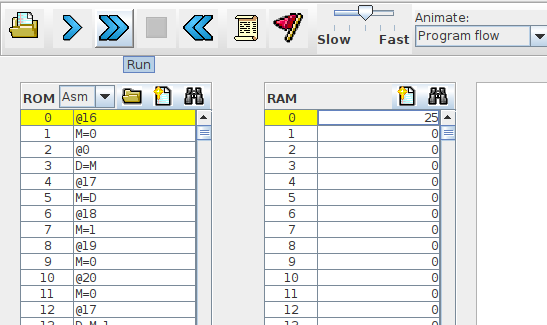
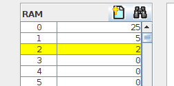

# Parcial 1

<center>
    
</center>

## Requirements

- Be sure to have the [**Nand2Tetris tools**](https://www.nand2tetris.org/software).

- Install Java.

## How to execute it?

- Open the Assembly tool

```
    ./Assembler.sh
```
And open the `main.asm` file.

<center>
    
</center>

- Use the `fast translation` option and save  `main.hack` file wherever you want.

<center>
    
</center>

- Open the CPU tool

```
    ./CPUEmulator.sh 
```
And open the `main.hack` file.

<center>
    
</center>

- Change the `RAM` first value with the `X` value you want.

<center>
    
</center>

- Use the `RUN` option.

<center>
    
</center>

- There you have it:

    - First `RAM` value [0] is the `X`.
    - Second `RAM` value [1] is the `Square root of X`.
    - Third `RAM` value [2] is the `Square root of X minus 3`.

<center>
    
</center>

